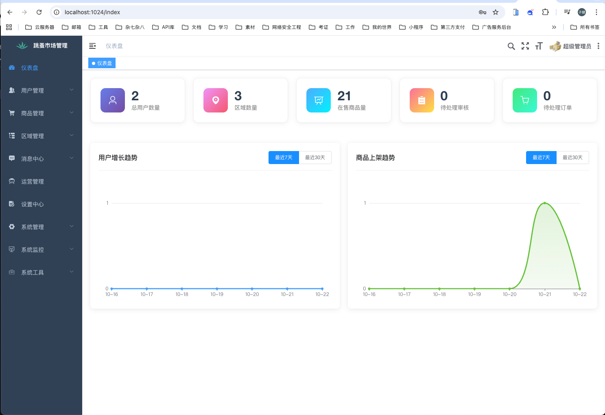

<table>
<tr>
  <td>

&emsp; 男 | 19岁 &emsp; 📞 18855668515 &emsp; 📪 eatfan0921@163.com | eatfan0921@gmail.com

&emsp;我们正在让这个世界变得更加美好，通过代码的重复使用和延展构建完美体系。

&emsp;

&emsp;

<strong>&emsp;&emsp;We're making the world a better place. Through constructing elegant hierarchies for maximum code reuse and extensibility.</strong>

  </td>
</tr>

<tr>
  <td>
    <h4>个人优势</h4>
    
1. 熟悉C/C++、Java、Python、Js、Ts、Go等多种语言；

    
2. 熟悉Vue、Uni-app、Spring系列、RuoYi、Flutter、Electron等多种框架；

    
3. 熟悉主流的数据库MySQL、Redis、MongoDB;

  </td>
</tr>

<tr>
  <td>
    <h4>项目经历</h4>

  <!-- 项目 1 -->
  

    
    <h4 style="margin:10px 0 5px 0;">FleaMarket小区域二手跳蚤市场小程序</h4>
    
<strong>技术栈：</strong>uni-app、Vue3、RuoYi、SpringBoot、MySQL、Redis、前后端分离

    
随着共享经济和可持续发展理念的普及，二手物品交易市场需求不断增长。 特别是在特定区域内（如大学校园、社区小区等），用户对于便捷、安全的二手交易平台有着强烈需求。 本项目旨在开发一个基于微信小程序的二手交易平台，为特定区域内的用户提供便捷的二手物品交易服务平台。

  

  <!-- 项目 2 -->
  

    
    <h4 style="margin:10px 0 10px 0;">auto-register 自动注册机</h4>
    
<strong>技术栈：</strong>python爬虫、tkinter、requests

    
本项目为网站批量自动化注册账号的注册机，可随机大批量注册账号，也可以自定义导入用户数据进行大批量注册。可以通过自行修改，去修改临时邮箱API或者自行搭建邮箱服务器，调用邮箱服务API。

  

  <!-- 项目 3 -->
  

    
    <h4 style="margin:10px 0 10px 0;">Flutter-Tiktok 抖音App Flutter版本仿制</h4>
    
<strong>技术栈：</strong>dart、flutter

    
使用Flutter开发一个抖音app，通过使用Flutter加上模拟的数据，一比一模仿抖音移动端app，此项目，90%还原抖音app，所有UI设计按照抖音来实现，但是不同的是部分图标素材；项目中使用的数据部分为本地数据，数据来源于抖音，所有的视频非恶意盗取，仅供学习，无商业；项目中用到video_player、preload_page_view等插件依赖，很大部分Flutter widget

  

  </td>
</tr>

<tr>
  <td>
    <h4>证书墙</h4>

  </td>
</tr>

</table>

<!-- github自述 -->

  
  

<!-- dynamic typing effect 动态打字效果 -->

  

<!-- knock code pictures 敲代码的图片 -->

 

  

<!-- profile logo 个人资料徽标 -->

&emsp;

&emsp;

&emsp;

&emsp;

<!-- visitor statistics logo 访问量统计徽标 -->

  

<!-- Snake Code Contribution Map 贪吃蛇代码贡献图 -->

<picture>

<source media="(prefers-color-scheme: dark)" srcset="https://cdn.jsdelivr.net/gh/sun0225SUN/sun0225SUN/profile-snake-contrib/github-contribution-grid-snake-dark.svg" />

<source media="(prefers-color-scheme: light)" srcset="https://cdn.jsdelivr.net/gh/sun0225SUN/sun0225SUN/profile-snake-contrib/github-contribution-grid-snake.svg" />

</picture>

  

  

# 🙋 Hello

  

<table>

<tr><td>

  

<!-- About me 关于我 -->

### 🤺 About Me

  

  

&emsp;&emsp;你好啊！我是EatFan，你可以叫我“饭”。

&emsp;&emsp;喜欢开发！喜欢滑板！喜欢自由！

&emsp;&emsp;热爱计算机科学和IT互联网事业，励志成为一名优秀的全栈开发者。

&emsp;&emsp;我们正在让这个世界变得更加美好，通过代码的重复使用和延展构建完美体系。

<strong>&emsp;&emsp;We're making the world a better place. Through constructing elegant hierarchies for maximum code reuse and extensibility.</strong>

  

</td></tr>

  

<tr>

<td>

  
  

<tr><td>

  

<!-- wakatime 统计 -->

### 📊 Most used languages

  

  

</td></tr>

  

<tr><td>

  

<!-- skill badge 技能徽章 -->

  

<!-- programming tool icon 编程工具图标 -->

<h3>展示台</h3>

  

 

 

 

 

 

  

<!-- svg -->

 

  

<!-- gif -->

  

<!-- just img 图片 -->

  
  

  

<!-- ########################################## 分割 ########################################## -->

  
  
  

</td></tr>

</table>

  
  

  
  

<!-- ########################################## 分割 ########################################## -->

  

<!-- GitHub 奖杯🏆 -->

 

  

<!-- GitHub 数据统计 -->

  

  
  

<!-- ########################################## 分割 ########################################## -->

  

  

<!-- GitHub Activity Graph GitHub 活动图 -->

<table align="center">

<tr>

<td></td>

</tr>

</table>

  

  

<!-- ########################################## 分割 ########################################## -->

  

<!-- GitHub metrics 信息指标 -->

 

